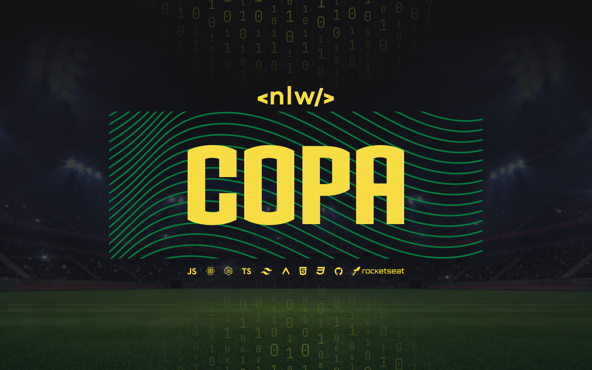
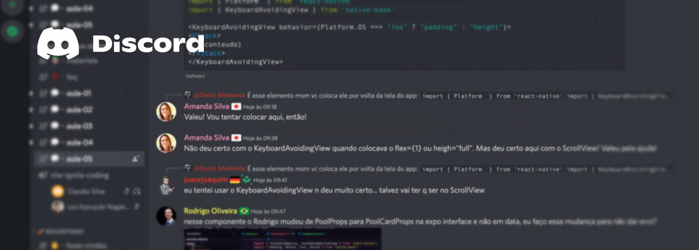
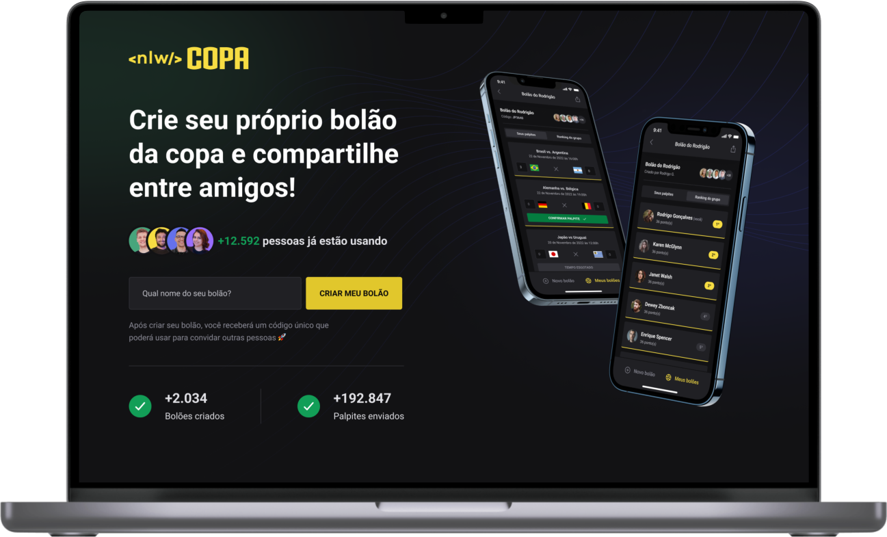
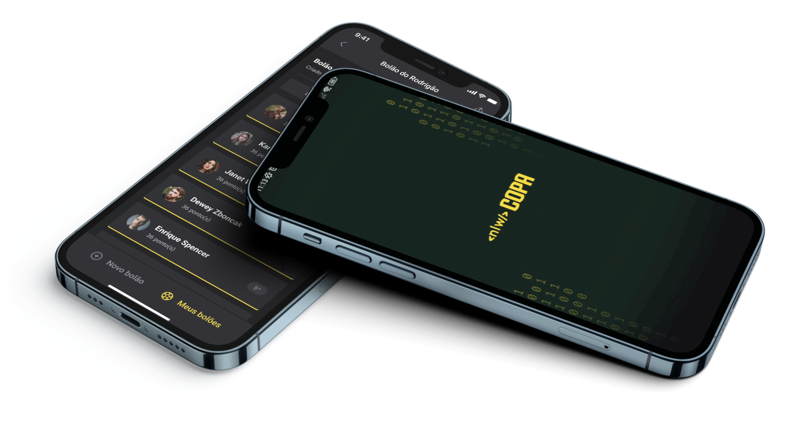

# NLW - Copa 2022 (Rocketseat) ⚽️

## Um evento online e gratuito de programação, na prática. Com muito código, desafios, networking e um único objetivo: te levar para o próximo nível. :atom:

Participar desse magnifico evento promovido pela [Rocketseat](https://github.com/Rocketseat) foi incrível, curti tanto que estou adicionando ele no meu github, quero compartilhar essa experiencia com vocês. :fire:

Todos os participantes do evento tiveram a oportunidade de trabalhar e conhecer tecnologias incríveis, e apesar do conteúdo não aprofundar sobre cada tecnologia apresentada, pois foram **muitas!** E não teríamos tempo para concluir tudo em uma semana. Conseguimos entender perfeitamente o que cada uma delas fazem e como podemos utilizá-las na realidade.

Em resumo, desenvolvemos um aplicativo e site para criarmos e participarmos de bolões da copa, uma aplicação completa, web e mobile com front-end e back-end.

---

### Documentações:
- [Backend - Pasta Server]()
- [Frontend - Pasta Web]()
- [App - Pasta mobile]()

---

### Tecnologias utilizadas:

[`React`](https://github.com/facebook/react/) | [`ReactNative`](https://github.com/facebook/react-native) | [`Node.js`](https://github.com/nodejs/node) | [`TypeScript`](https://github.com/microsoft/TypeScript) | [`Expo`](https://github.com/expo/expo) | [`Tailwhind`](https://github.com/tailwindlabs/tailwindcss) | [`Prisma`](https://github.com/prisma) | [`Fastify`](https://github.com/fastify/fastify) | [`XCode`](https://developer.apple.com/xcode/) | [`Insomnia`](https://github.com/Kong/insomnia)

---

### Bibliotecas utilizadas:
- :octocat:	[Zod](https://github.com/colinhacks/zod)
- :octocat:	[short-unique-id](https://github.com/simplyhexagonal/short-unique-id)
- :octocat:	[react-native-svg-transformer](https://github.com/kristerkari/react-native-svg-transformer)
- :octocat:	[Country-list](https://github.com/fannarsh/country-list)
- :octocat:	[react-native-country-flag](https://github.com/YannisHofmann/react-native-country-flag)
- :octocat:	[Day.js](https://github.com/iamkun/dayjs/)
- :octocat:	[dotenv](https://github.com/motdotla/dotenv)
- :octocat:	[babel-plugin-inline-dotenv](https://www.npmjs.com/package/babel-plugin-inline-dotenv)

---

### Comunidade Rocketseat:

Além do planejamento, organização e conteúdo do evento terem sidos extremamente ótimos na minha opinião. A comunidade dentro do Discord da Rocketseat foi fenomenal, diversos níveis de programadores contribuindo e se preocupando com os problemas alheios.

Vivenciei uma experiência de aprendizagem única! Me senti em um verdadeiro time, e gostaria de mencionar alguns nomes que me ajudaram muitoooo. Mas o agradecimento vai para a comunidade inteira.

Caso você tenha contribuido e eu esqueci de te mencionar, por favor, me avise! :hand_over_mouth:

[:star: killersmath](https://github.com/killersmath)
[:star: RodrigoApOliveira](https://github.com/rodrigoapoliveira)

---

## Mestres

:eight_pointed_black_star: [@jakeliny](https://github.com/jakeliny) | :eight_pointed_black_star: [@diego3g](https://github.com/diego3g) | :eight_pointed_black_star: [@rodrigorgtic](https://github.com/rodrigorgtic) | :eight_pointed_black_star: [@maykbrito](https://github.com/maykbrito)

---

## Resultado Final:

## #neverstoplearning